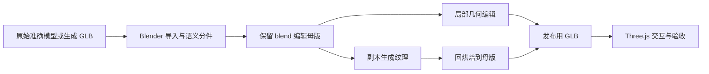

# Blender / Three.js 高保真建模：开源方案、GLB 编辑与准确 3D 底模实验

研究日期：2026-09-06。对象：本项目心脏与人体教育资产。结论置信度：GLB 互操作与本地问题定位高；建议管线的可实现性中高；对用户准确底模的实际质量增益尚待实验。

本次完成资料研究、当前源码与历史产物检查，没有运行新生成模型或修改现有 3D 模型。用户所说的“3ddiffusion”尚未对应到明确项目/版本，GLB 部分按标准 glTF 2.0 mesh 资产讨论。准确人体模型的路径、格式、分件和纹理情况尚未提供。

## 结论与优先级

**当前最值得改变的是工作流：保留准确 3D 几何，给 agent 提供可查询、可局部操作的三维资产，再独立改善材质。** 对复杂器官，继续从图片手写椭球和管道的收益可能已经较低。这个优先级来自本地证据与下述论文的综合判断，不是已经测得的提升幅度。

四个问题的直接回答：

1. **有可用的开源/开放权重组件，但没有查到已经可靠解决“任意医学图像 → 精确且易编辑器官”的通用方案。** MV-Adapter 的几何条件贴图、Hunyuan3D-Paint、TRELLIS.2 texturing 最值得实验；PartField 可辅助分件；BlenderGym 和 ViSculpt 提供编辑与评价思路。
2. **GLB 可以直接导入 Blender，也可以直接由 Three.js 加载和编辑。** 无需把网格翻译成数千行建模源码；导入不会恢复原始建模历史。[Blender glTF 文档](https://docs.blender.org/manual/en/5.1/addons/import_export/scene_gltf2.html)、[GLTFLoader](https://threejs.org/docs/pages/GLTFLoader.html)
3. **三维参考很可能有帮助，但“多看几张图”“查询 3D 数据”“直接复用底模”是三个不同实验。** 其中复用高质量底模最能提高交付质量的下限，但它证明的是资产编辑能力。
4. **我最推荐的新方向是：准确资产库 + 语义部件 + 受约束的局部编辑 + 分尺度细节 + 材质回烘焙。** agent 负责选择工具、调参数和验收，数值几何操作由确定性算法执行。

## 1. 当前模型为什么仍显得简陋

### 1.1 本地证据，而非泛泛判断

本次实际查看了两组最终对照图：

- [Blender 原图与实际渲染对照](D:/Learn/20_Projects/3dresearch/3d-program/heart_reference_matched_20260905/renders/reference_comparison.png)
- [Three.js 原图、调整前、调整后对照](D:/Learn/20_Projects/3dresearch/3d-learning/reproductions/agent-3dgeneration/img2threejs/workspaces/heart-multiview-retry/output/reference-final-03/reference-comparison-all.png)

可以看到的主要差距是：心耳宽软而缺少层叠褶皱，脂肪仍有带状/颗粒化特征，血管的截面和根部过渡过于规则，远端分支稀疏；表面有细噪声，但参考图的中尺度起伏和材质层次没有同步还原。

| 证据 | 观察 | 对改进的含义 |
|---|---|---|
| [Three.js 工厂](D:/Learn/20_Projects/3dresearch/3d-learning/reproductions/agent-3dgeneration/img2threejs/workspaces/heart-multiview-retry/src/createHeartModel.ts:193) | 心房/心耳有椭球构造，血管用曲线管道，心室用截面参数生成 | 面数增加不等于形状自由度足够；需要真实参考表面或更合适的局部操作 |
| [Blender 早期构建](D:/Learn/20_Projects/3dresearch/3d-program/heart_multiview_20260905/scripts/build_heart.py:161)、[最新匹配脚本](D:/Learn/20_Projects/3dresearch/3d-program/heart_reference_matched_20260905/scripts/match_reference.py) | 已有 tube、blob、噪声、remesh 和局部形变，并非完全没有精修 | 瓶颈不能简单归因于缺少 subdivision 或 remesh |
| [Three.js 验收记录](D:/Learn/20_Projects/3dresearch/3d-learning/reproductions/agent-3dgeneration/img2threejs/workspaces/heart-multiview-retry/reference-refinement.md) | 结构、间距和 UI 检查通过；四视图原图拟合仍未完整通过 | “程序运行/检查通过”不能代表“已经高保真还原” |
| [Blender 参考匹配复核](D:/Learn/20_Projects/3dresearch/3d-program/heart_reference_matched_20260905/reference-comparison-review.md) | 历史复核也承认心耳、远端血管、心房起伏等简化 | 历史“可交付”的判断与用户要求的更高保真度是不同门槛 |

本次直接读取现有 `heart_reference_matched.glb` 的二进制头和 JSON：glTF 2.0，**102 个 mesh、12 个材质、18 张内嵌图像、119.68 MiB**，没有声明 `extensionsUsed/Required`。这是 Blender 导出的现有资产，不是本次新生成的 diffusion 结果。这项检查只证明文件中的资源声明，不替代重新加载渲染。

因此，“GLB 没有贴图”不能解释当前最新版本的全部差距。根目录上下文还记录：其中六个主表面烘焙了 Base Color、Roughness、Normal，完整程序材质和 SSS 留在 `.blend`。

### 1.2 四类瓶颈要分开

**输入信息不足。** 目前多视图含有从单图生成、再经图像编辑的结果，没有经过真实相机标定。它们可以辅助外观设计，不能与同一真实模型渲染得到的 depth/normal/多视角当成同等几何证据。[项目上下文](D:/Learn/20_Projects/3dresearch/AI_CONTEXT.md)

**表示和操作能力不足。** 椭球能表达体积，圆管能表达路径，但难以仅靠少数控制参数表达复杂心耳、小叶和非圆形血管根部。这是本次代码与渲染对照的工程推断，不是对 Blender 或 Three.js 表达能力的限制。

**细节尺度混用。** 建议把轮廓/厚度交给真实几何，把褶皱/脂肪小叶交给局部雕刻或足够细的位移几何，把不改变轮廓的微细节交给 normal/roughness。随机噪声不能替代有方向、有边界的结构。Blender 的 normal/bump 与真实 displacement 对几何的作用不同。[Blender 4.5 材质位移说明](https://docs.blender.org/manual/en/4.5/render/cycles/material_settings.html)

**评价目标混在一起。** 当前检查侧重部件、标签与部分空间关系；真实材质、局部形状和用户所说的“不规则部分”需要单独近景验收。参考插画的夸张表面风格也应与解剖模型分层保存，避免每次风格调整重新造基础结构。

## 2. 最值得实验的项目与论文

### 2.1 生成与材质管线

| 项目 | 可以解决什么 | 公开程度/适用边界 | 对当前硬件的判断 |
|---|---|---|---|
| **[MV-Adapter](https://github.com/huanngzh/MV-Adapter)**，ICCV 2025 | 输入图片与已有 mesh，生成受几何条件约束的多视图，提供 image-to-texture GLB 输出 | Apache-2.0 代码、公开适配器；底座等依赖另有许可。核心是多视图/纹理，不应称为完整 PBR 恢复 | 官方 SD2.1 几何/贴图分支面向低显存，值得在 12GB 上先试；完整贴图还需额外环境 |
| **[Hunyuan3D 2.1](https://github.com/Tencent-Hunyuan/Hunyuan3D-2.1)** | Shape 与 Paint 分开，Paint 可接受现有 mesh 与参考图，输出 PBR 材质 | 代码、权重、训练代码公开；采用自定义 Community License，不能笼统按 MIT 项目对待 | 官方标称 Shape 10GB、Paint 21GB、合计 29GB。12GB 尚不能视为标准 PBR 路线已满足；低显存模式需实测 |
| **[TRELLIS.2](https://github.com/microsoft/TRELLIS.2)** | 原生 3D 生成、复杂拓扑与 PBR；有独立的给定 shape 贴材质流程 | MIT；O-Voxel 表示可处理开放表面和复杂结构，不等于每次生成都正确 | 官方最低 24GB NVIDIA、主要 Linux，测试 A100/H100；作为大显存对照，不能套用官方速度到 RTX 5070 |
| **[Hi3DGen](https://github.com/bytedance/Hi3DGen)**，ICCV 2025 | 用 normal map 中间表示改善单图几何细节 | MIT 仓库及模型入口；侧重几何，不是完整材质或精确器官恢复 | 本次未找到可据此保证 12GB 完整推理的官方规格，列次级候选 |
| **[Paint3D](https://github.com/OpenTexture/Paint3D)**，CVPR 2024 | 对既有 mesh 从文字/图片生成 2K UV 纹理，专门减轻纹理中烘入光照的问题 | Apache-2.0 代码；公开模型与依赖入口，依赖许可分开。不是全通道 PBR 保证 | 官方测试环境较旧；适合作为纹理方法对照，不能假设原生 Windows/5070 开箱可用 |

相应论文：[MV-Adapter](https://arxiv.org/abs/2412.03632)、[Hunyuan3D 2.1](https://arxiv.org/abs/2506.15442)、[O-Voxel](https://arxiv.org/abs/2512.14692)、[Hi3DGen](https://arxiv.org/abs/2503.22236)、[Paint3D](https://arxiv.org/abs/2312.13913)。论文中的通用物体效果不能直接外推为心脏解剖正确率。

**优先顺序建议：已有准确 mesh 的纹理试验 → 局部编辑试验 → 新的单图生成器对照。** 只有缺少可靠基础结构的部件，才优先交给生成器创造几何。

没有把检索中出现的更新商业产品名称直接视为开放实现；例如本次明确核到代码与权重的是 Hunyuan3D 2.1。模型服务可用、仓库有代码、模型权重开放、许可证允许目标用途，应分别确认。

### 2.2 对本项目最关键的发现：MV-Adapter 已有入口，但默认流程不适合直接处理整个解剖母版

本地 vendor 已有 `scripts/texture_i2tex.py`、`inference_ig2mv_sd.py`、`inference_ig2mv_sdxl.py`。现有自定义 runner 只跑 image-to-four-view，并主动避开 mesh/rasterization 依赖；所以**已有四视图成功记录不代表贴图管线已验证**。[本地 runner 上下文](D:/Learn/20_Projects/3dresearch/AI_CONTEXT.md)、[本地贴图入口](D:/Learn/20_Projects/3dresearch/vendor/MV-Adapter/scripts/texture_i2tex.py)

官方贴图流程还要求 CV-CUDA。其官方平台说明明确：原生 Windows 不支持，支持 WSL2。因而合理实验环境是单独的 WSL2/Linux 环境，或工程上实现并验证替代依赖；不能直接承诺复用当前 Windows venv 即可运行。[CV-CUDA 官方兼容说明](https://github.com/CVCUDA/CV-CUDA#compatibility)

更重要的是，对当前固定提交 `4277e001...` 做代码级复核发现：

- `texture_i2tex.py` 固定启用 `uv_unwarp=True`，所以即便没有打开几何预处理，也会重建 UV。
- mesh 处理函数可能拼接多个物体；UV 展开会拆分/重排顶点，不能按原始顶点序号回写。
- 打开 `--preprocess_mesh` 还会做删小部件、补洞、平滑、面数简化等操作，可能损伤细血管或独立结构。
- 贴图替换函数主要按第一个材质/节点处理，不应假定它会保留完整人体的层级和多材质语义。

源码证据：[贴图入口](https://github.com/huanngzh/MV-Adapter/blob/4277e0018232bac82bb2c103caf0893cedb711be/scripts/texture_i2tex.py)、[mesh 预处理与 UV](https://github.com/huanngzh/MV-Adapter/blob/4277e0018232bac82bb2c103caf0893cedb711be/mvadapter/utils/mesh_utils/mesh_process.py)、[纹理输出](https://github.com/huanngzh/MV-Adapter/blob/4277e0018232bac82bb2c103caf0893cedb711be/mvadapter/utils/mesh_utils/mesh.py)。

建议用**工作副本生成纹理，再将外观烘焙回准确母版**。若 UV 不同，必须做空间/表面投射烘焙，不能直接把新贴图挂到旧 UV 上。分件运行时保持全局坐标和相邻结构的遮挡参考，避免每个部件独立归一化后失去装配关系。

TRELLIS.2 也不能简单称为“逐顶点锁定”。其 texturing 在输入 mesh 上采样生成的 PBR 属性，没有把最终几何从 O-Voxel 重新生成；但它会归一化/转换坐标，无 UV 时会重新展开，官方 UI 对 Scene 还会合并。仍需要母版、副本和显式映射。[texturing 源码](https://github.com/microsoft/TRELLIS.2/blob/75fbf0183001ed9876c8dbb35de6b68552ee08bd/trellis2/pipelines/trellis2_texturing.py)、[UI 导入](https://github.com/microsoft/TRELLIS.2/blob/75fbf0183001ed9876c8dbb35de6b68552ee08bd/app_texturing.py)

### 2.3 分件、编辑与 agent 研究

| 项目/论文 | 值得借用的能力 | 不应据此推断的能力 |
|---|---|---|
| **[PartField](https://github.com/nv-tlabs/PartField)**，ICCV 2025 | 给 mesh 提取部件特征并聚类；已有 Objaverse 权重，可辅助局部选择 | 聚类不是解剖语义真值；心腔、血管命名还需校正。已带部件的底模可跳过它 |
| **[SAMPart3D](https://github.com/Pointcept/SAMPart3D)**，CVPR 2025 | 多尺度部件分割，公开实现，可生成候选区域 | 不是一个通用医学分割器，也不会把部件变成有真实接口的参数模型 |
| **[TextDeformer](https://github.com/threedle/TextDeformer)**，SIGGRAPH 2023 | 对已有网格做语义驱动形变，通过 Jacobian 优化和正则化限制形变 | 不恢复 PBR，不保证解剖连接与自交始终正确 |
| **[Neural Jacobian Fields](https://github.com/ThibaultGROUEIX/NeuralJacobianFields)**，SIGGRAPH 2022 | 学习/迁移连续形变；可借鉴为模板变形工具 | 原论文学习设置依赖相应训练与对应数据；不是任意两模型一键精确配准 |
| **[BlenderAlchemy](https://github.com/ianhuang0630/BlenderAlchemyOfficial)**，ECCV 2024 | 从已有 `.blend` 出发，用视觉评价搜索材质、灯光、shape key、Geometry Nodes 的编辑 | 公布代码不等于任意非参数器官雕刻已经解决，仍依赖底层可操作参数和模型服务 |
| **[BlenderGym](https://github.com/richard-guyunqi/BlenderGym-Open)**，CVPR 2025 | 245 个编辑任务；将 geometry/material/lighting 等任务分开评价 | 是评测框架，不是提升网格精度的生成模型 |
| **[ViSculpt](https://arxiv.org/html/2608.24169v1)**，2026-08-25 预印本 | 在 Blender 中观察现有 mesh，选择视图、定位区域、局部笔刷编辑、再反思 | 本次未找到已发布官方代码/benchmark；论文仍称将发布，不能当现成开源依赖 |

**ViSculpt 是本次最贴近问题的新论文。** 它把局部操作压缩为 Smear、Drag、Draw，采用六向视图与视觉 mask；20 个编辑任务和主观盲评提供了初步可行性证据。不过它主要研究表面形变，不支持通用拓扑编辑；二维 mask 不是顶点级保护，视觉评分也不能证明内部几何和未编辑区域正确。值得借鉴它的操作设计，再补三维区域约束与客观检查。[全文方法与局限](https://arxiv.org/html/2608.24169v1)

不建议优先押注的两条路：

- **单纯更换“专门写 Blender 代码”的 LLM。** BlenderLLM 官方列出的限制包括基础 CAD、缺少材质/内部结构/图像输入等，它不是当前器官问题的直接解法。[BlenderLLM](https://github.com/FreedomIntelligence/BlenderLLM)
- **不加区分地进行生成式低面数重拓扑。** MeshAnything V2 官方输出面数上限为 1600；对整颗细血管心脏，我不建议以它作为保真母版压缩器。这是结合官方限制与本任务的判断。[MeshAnything V2](https://github.com/buaacyw/MeshAnythingV2#important-notes)

## 3. GLB 能否直接变成可编辑 Blender / Three.js 资产

### 3.1 可以导入，但不是反编译建模过程

GLB 是 glTF 的二进制容器，可装网格、节点、材质、贴图、蒙皮和动画等。它不以保存创作历史为目标。因此可以编辑最终顶点、面和材质，但一般无法恢复原来的 modifier stack、布尔顺序、Geometry Nodes、CAD 约束或人工拓扑意图。[Khronos glTF 规范](https://registry.khronos.org/glTF/specs/2.0/glTF-2.0.html)

这并不妨碍 coding agent 工作：agent 可以写少量代码加载复杂 GLB，然后编辑已有资产。复杂性存放在资产中，不必全部压进 TypeScript/Python 的构造语句。

| 操作 | Blender | Three.js |
|---|---|---|
| 导入/显示 GLB、遍历部件 | 支持 | `GLTFLoader` 支持 |
| 改位置、缩放、材质、显隐、标签 | 支持 | 很适合 |
| 修改顶点、局部算法形变 | 有完整网格工具和 Python API | 可改 `BufferGeometry`，约束与更新由应用负责 |
| 雕刻、重拓扑、UV、复杂材质烘焙 | 更适合成为制作端 | 核心 Three.js 不提供完整 DCC 工作流 |
| 输出可部署 GLB | glTF 导出器 | `GLTFExporter` |
| 自动恢复历史程序化源码 | 不支持通用恢复 | 不支持通用恢复 |

依据：[Blender glTF 导入导出](https://docs.blender.org/manual/en/5.1/addons/import_export/scene_gltf2.html)、[GLTFLoader](https://threejs.org/docs/pages/GLTFLoader.html)、[GLTFExporter](https://threejs.org/docs/pages/GLTFExporter.html)、[TransformControls](https://threejs.org/docs/pages/TransformControls.html)。Three.js 的 TransformControls 是对象平移/旋转/缩放控件，不是雕刻器。

### 3.2 推荐资产流

具体步骤：

1. Blender 中 `File → Import → glTF 2.0`，导入后先保存独立 `.blend`。
2. 检查 Outliner 与材质。现有分件优先复用；单一 mesh 才考虑连通块、材质分区或 PartField 辅助区域选择。连通块并不自动等于器官。
3. 对明确目标做局部编辑。需要改表面外观时，先保持基础几何，只更换材质/纹理。
4. 另存编辑母版，导出发布用 GLB。Three.js 通过 loader 加载、按稳定 ID 选择部件；若重导出，必须把需要保留的动画（例如加载得到的 `gltf.animations`）显式传入 exporter 的 `animations` 选项，其默认值是空数组。自定义扩展另需相应数据与 `includeCustomExtensions`，并核对双方支持情况。
5. 新建干净场景重新导入，检查局部修改、贴图、尺度和所有需保留部件，再在目标浏览器中检查。

对当前项目，推荐**一个 Blender 母版 + 一个 Three.js 展示/交互端**，减少两份心脏几何独立维护造成的差异。Three.js 仍可提供高亮、透明、剖切展示、分层隐藏和教学标注；需要真实断面结构时必须有相应内部模型，不能靠显示裁剪补出内部解剖。

### 3.3 导入后“能编辑”和“很好编辑”的差别

生成的密集三角网格能进 Edit Mode，但可能没有语义分件、适合变形的拓扑或良好 UV。根据目标处理即可：只改颜色不必重拓扑；需要精细雕刻才考虑局部重采样；需要稳定动画才重点维护拓扑和权重。

互操作重点：

- 程序 shader 与 Blender SSS 不会作为完整节点图进入核心 glTF；normal 贴图可以近似微细凹凸，不能完整烘焙视角相关散射。[Blender 文档](https://docs.blender.org/manual/en/5.1/addons/import_export/scene_gltf2.html)
- 本项目 Three.js 材质使用 `onBeforeCompile`。这类自定义 shader 逻辑不能假定由 GLTFExporter 自动还原；应烘焙为标准贴图，或在应用端明确重建。[本地材质](D:/Learn/20_Projects/3dresearch/3d-learning/reproductions/agent-3dgeneration/img2threejs/workspaces/heart-multiview-retry/src/heartMaterials.ts:49)、[GLTFExporter](https://threejs.org/docs/pages/GLTFExporter.html)
- Base Color/emissive 使用 sRGB，normal/roughness/metallic/AO 是数据纹理；roughness 在 G、metallic 在 B，AO 可使用 R。模型导入导出后必须核查颜色空间和通道含义。[glTF 材质规范](https://registry.khronos.org/glTF/specs/2.0/glTF-2.0.html)
- 能加载 Draco、Meshopt、KTX2 或某材质扩展，不代表能原样再次导出；以目标 loader/exporter 的交集验收。[GLTFLoader](https://threejs.org/docs/pages/GLTFLoader.html)
- Blender 与 Three.js 两套现有脚本使用不同前向约定，接入时保存显式坐标变换、单位与 ID 映射，不能靠目测旋转补偿后丢弃记录。[Blender 上下文](D:/Learn/20_Projects/3dresearch/AI_CONTEXT.md)、[Three.js 上下文](D:/Learn/20_Projects/3dresearch/3d-learning/reproductions/agent-3dgeneration/img2threejs/AI_CONTEXT.md)

最小验收要求：glTF Validator 无错误；前后部件/材质/图像/动画清单可解释；未编辑区域无越界变化；独立重新导入与浏览器加载成功；固定相机/灯光下的外观变化符合目标。有动画的资产再加起始、中间、结束姿态检查。Validator 只能检查格式，不验证器官形状。[Khronos Validator](https://github.com/KhronosGroup/glTF-Validator)

文档版本说明：本机记录是 Blender 4.5.13 LTS；本次 4.5 网页入口未成功读取，互操作说明参考可访问的 5.1 手册。核心流程成立，具体扩展支持需要在本机 4.5 与项目锁定 Three.js 版本中实测。

## 4. 如何用准确人体 3D 模型提升 agent

### 4.1 先判断“准确”覆盖哪些内容

本报告暂把用户模型当作待接入的几何基准，不对尚未检查的模型作认证。实验前只需建立资产清单：文件格式、单位、坐标、部件、UV/纹理、骨骼/动画、内部结构范围。

- **准确全身外表面**能改善体型、姿态和可见轮廓，不能自动提供内部器官。
- **准确器官几何但无材质**适合纯外观提升；不能直接拿来评估 PBR 数值恢复。
- **已有准确分件与纹理**直接继承，agent 重点做局部改动与教学交互。
- **只有扫描三角面、没有部件名**先建立语义选择区域，不需要先强行变成全参数模型。

### 4.2 让 agent “看 3D”应是一组工具

建议的接口设计如下，属于新方案而非已经实现：

| 能力 | 返回信息 | 用途 |
|---|---|---|
| `list_parts` / `get_materials` | ID、名字、父子关系、材质槽 | 明确编辑对象 |
| `render_views` | RGB、无材质几何、depth、normal、object-ID | 把外观问题和几何问题分开 |
| `measure_part` / `get_landmarks` | 尺寸、截面、地标、方向 | 避免凭图片猜坐标 |
| `raycast` / `closest_point` | 世界坐标、法线、部件 ID | 把表面血管、脂肪或标记放在真实表面 |
| `get_edit_mask` | 三维面/顶点集合和边界 | 把允许修改范围落到 mesh 上 |
| `apply_local_edit` | 受限操作与变更日志 | 局部形变、曲面贴合、材质修改 |
| `validate_change` | 保护区漂移、连接/间距、导出情况 | 自动发现改坏的部件 |

agent 不需要在上下文中阅读几十万顶点；它需要能选中一个部件、询问一处表面、调用可靠算子，并查看前后变化。这个设计结合了 BlenderAlchemy 的可操作参数、ViSculpt 的视觉闭环和 PartField 的区域表示。

### 4.3 三种使用层次

**层次一：从底模渲染真实多视图，再让 agent 从零建模。** 实施最简单，适合验证输入信息是否是瓶颈。

**层次二：把底模作为只读参考，给结构化查询。** agent 可以量尺寸、看截面和查曲面；如果仍只用椭球/圆管输出，可能改善布局但仍缺少复杂局部形状。

**层次三：直接在底模上编辑。** 这最适合交付：已有的精细结构无须重新推断，只处理要改变的区域。低维 cage/lattice、shape keys、局部表面变形可以保留更多既有信息；不同拓扑的新增结构仍需单独建模或生成。

所以答案是：**有理由预期效果更好，尤其是直接保留底模；但三维输入并不会自动解除有限建模操作的上限。**

## 5. 可执行的对照实验

下列数量、预算和阈值是建议实验设置，不是论文中的既定标准。

### 5.1 实验一：区分输入不足与建模表示不足

从一个高质量目标模型导出固定相机资料，选三个困难局部：心耳褶皱、脂肪与表面血管、一个不规则血管分叉。全身模型则换成对应的耳廓、手指或肌肉/关节表面。

| 组 | 输入 | 起点与操作限制 | 测试目的 |
|---|---|---|---|
| A | 单张真实渲染图 | 空场景，当前脚本工具 | 当前单图基线 |
| B | 单图生成的四视图 | 空场景，与 A 同工具 | 合成视角是否实际有收益 |
| C | 同一真实模型的 6 个校准 RGB 视图 | 空场景，与 A 同工具 | 真实多视图是否优于猜测多视图 |
| D | C + 受限 depth/截面/地标/表面查询 | 空场景，与 A 同工具 | 结构化三维信息的额外收益 |
| E | 与 D 相同 | 空场景，增加局部雕刻/cage/曲面贴合等算子 | 操作集合是否才是主要瓶颈 |

其中 D 不开放原始完整网格下载/复制，限制查询数量和采样密度；否则它会退化为几何拷贝实验。受限查询也包含目标信息，应明确写在实验协议中。

固定同一 agent 模型版本、提示模板、输出资产预算；每次最多例如 6 轮改进与相同 token 上限，同时记录实际耗时、工具调用和显存。A–D 保持编辑工具一致；D–E 才改变操作集合，不能同时改变输入后把收益全部归给“三维参考”。

先做一个困难局部、A/C/D/E 各 3 次，12 次作为诊断试验；有明显差异再扩到三个局部与 B 组。小样本结果报告全部失败，不作泛化结论。正式比较按独立资产配对汇总，不能把同一模型的许多视角当成许多独立样本。

**判读：** C 明显优于 A，支持信息不足；D 又优于 C，支持三维查询有效；D 仍粗糙而 E 明显改善，支持编辑算子不足。若真实渲染目标也无法拟合，先修工具链，不应继续增加图像生成环节。

评测设置可借鉴 [BlenderGym](https://blendergym.github.io/) 和 [3DCodeBench](https://github.com/gaoypeng/3dcodebench)，但不要直接沿用通用物体评分作为医学结构正确率。

### 5.2 实验二：产品更关心的“保留底模做编辑”

设 F 组直接加载准确模型副本，给出具体编辑任务：

1. 保留全部几何，只改变组织表面的颜色/光泽与细纹。
2. 修改一个指定区域的形状，固定邻接边界和不相关部件。
3. 增加独立的教学高亮/标注/显示层，不改动基础结构。

几何编辑任务需要一个非平凡目标，例如专业人员制作的局部目标版本，或已知程序形变得到的测试目标。**若原始准确模型就是答案，F 组只能是“保真/编辑上界”，不能宣称 agent 的从零重建能力提升。**

制作高质量资产时，复用目标几何完全合理；研究重建方法时则必须披露这种信息优势。底模/目标/输入相机/评价数据分开保存。

### 5.3 实验三：固定几何，单独比较材质

使用同一母版几何，比较当前程序材质、MV-Adapter 贴图、Hunyuan3D-Paint 或 TRELLIS.2 PBR。高显存组作为可选远端实验，不把它当本机必须完成的前置。

确保比较的是同一个最终几何：AI 生成过程使用副本，重新烘焙到母版的 UV/材质槽。仅有 Base Color 的方法与具有多通道 PBR 的方法，分别报告能力；不要强行用一个分数抹平任务差别。

固定几个新相机，并至少使用两套灯光。检查高光是否随光线移动、是否存在烘死的阴影、贴图接缝或凭空画出的血管。若真实模型没有已知材质通道，只能评外观和多光照表现，不能宣称恢复了真实 roughness/SSS 参数。

### 5.4 验收指标

| 维度 | 建议指标 | 防止的误判 |
|---|---|---|
| 几何 | 均匀表面采样的双向 point-to-surface/Chamfer、法线差异、局部轮廓 | 只有正面像，背面错误 |
| 局部细节 | 三个指定 ROI 的近景、曲率/截面变化、薄结构保留 | 大面积主体掩盖小而重要的失败 |
| 保护区域 | 固定对象/区域的顶点与世界变换变化，必要时表面距离 | 修改一个部件导致全身漂移 |
| 拓扑与结构 | 自交、意外断连、应保留开口、部件/路径关系 | 无条件补洞或焊接抹掉结构 |
| 外观 | 固定光照与新光照、RGB/纯材质分开；有真实图时使用 LPIPS 辅助 | 靠贴图掩盖错误几何 |
| 可编辑性 | 指定部件能否选择、局部改材质、变形、重导出，记录成功率 | 把导入成功当成方便编辑 |
| 工程成本 | 总时长、token、GPU 峰值、失败次数、资产大小/加载性能 | 只展示最佳候选，不记录代价 |

不要通过非刚性配准把结果强行贴到目标后再计算误差；只消除协议中约定的坐标/单位变换。若单位未知，报告相对包围盒尺度误差，不编造毫米精度。纹理/UV 导出会合法地拆点，跨格式不宜直接用顶点数组哈希判等；在母版内可以严格锁定，跨格式应核对表面与语义映射。

输入/调参相机与最终评价相机分开。最终保留一组 agent 未用来迭代的斜视、背面、顶部和局部近景，防止只对四张固定截图优化。解剖结构与艺术风格仍分别验收。

## 6. 另外值得尝试的点子

### 6.1 数值优化器负责精调，agent 负责目标与约束

对于“轮廓不对、颜色不对、太亮/太暗”，不必全靠 agent 手猜参数。nvdiffrec 从多视图优化几何、材质与灯光，其代码已有 `base_mesh` 与 `lock_pos` 路径，可作为固定几何、优化外观的研究起点。它要求合适的相机和观测，旧依赖对当前 GPU 还需适配。[nvdiffrec](https://github.com/NVlabs/nvdiffrec)、[固定位置的代码路径](https://github.com/NVlabs/nvdiffrec/blob/main/train.py)

建议 agent 只决定可变参数、区域和误差权重，优化器寻找数值。没有标定的生成插画不适合直接充当严格逆渲染真值；可先用准确 3D 模型自产一个已知答案的测试集验证优化流程。

### 6.2 建立“准确底模 + 可替换外观”的资产库

把部件 ID、坐标、连接地标、可编辑区域、材质槽随资产保存。后续任务先检索可复用结构，再做少量变化。此项为工程设计建议：价值在于减少重复重建，并能积累实际验证过的局部编辑配方。

检索对象应是完整部件和已验证编辑参数，而非让 agent 把大量网格数值当文本记忆。必要时 PartField 辅助构建候选分件，最终语义沿用可信来源。

### 6.3 让错误触发换方法

设定局部失败规则：例如同一心耳在三轮参数调节后几何指标无改善，就停止继续调椭球，转为参考表面、局部雕刻或模板配准。可把失败区域及可操作建议记录为局部任务：“褶皱体积不足”比“更逼真一点”更可执行。

这是本次提出的调度策略，需要通过 D/E 对照验证；没有证据证明单纯增加 agent 数量会提高器官保真度。

### 6.4 分成几何母版、表现层、发布层

几何母版保留细节；表现层添加教学配色、强调线和可关闭的表面细节；发布层按目标设备减面、烘焙、生成 LOD。现有 GLB 已约 120 MiB，后续不能只增加面数和贴图尺寸，应先统计几何/图像占比，再有针对性优化。

保护细血管与关键轮廓，用法线贴图承载不影响轮廓的细节；不要对所有部件统一按比例减面。发布优化后的版本仍需接受与母版对照的局部误差与可见性检查。

### 6.5 如果想继续读论文，优先这条阅读线

先读 MV-Adapter 的 geometry conditioning 与 texture 分支，再读 Hunyuan3D 2.1 的 Paint；随后读 BlenderGym 的编辑评测，最后读 ViSculpt 的操作与反馈设计。需要建立整个纹理领域地图时，使用 2026 年作者维护的综述 [Advances in Neural 3D Mesh Texturing](https://github.com/sairajk/neural-mesh-texturing)，再回到具体论文核查能力。

## 7. 建议下一次真正动手的最小范围

**只挑一个高质量器官底模与一个困难局部。** 先在 Blender 和 Three.js 中展示同一 GLB，建立准确原件、编辑副本和固定相机；完成一次纯材质编辑与一次局部几何编辑，并验证保护区域。这一步不需要训练新的大模型。

然后运行 A/C/D/E 的小型诊断，并用母版副本试 MV-Adapter SD2.1 几何条件贴图。先处理单个结构和 UV 回烘焙，确认结果真的写回了可旋转三维资产，再考虑整个人体、多个器官或更大的 PBR 模型。

需要接入的具体资料是：准确模型路径/格式、是否分件、是否有真实纹理，以及一个明确希望改善的局部。它们决定实施细节，不影响本报告的总体判断。

## 方法、证据与限制

本次按四条问题线并行搜索官方仓库、作者论文与文档；主会话检查本地模型工厂、验收记录和实际对照图，读取最新 GLB 容器统计，并对贴图管线的几何保持问题追加源码核查。用户指定 deep-research；当前无可调用的 Exa/Firecrawl，使用网页搜索与官方页面读取替代。旧研究报告仅用于定位相关工作，关键推荐重新核查。

置信度边界：官方支持接口/模型开放情况和本地文件检查是事实；“对这个器官效果更好”“哪条管线收益最高”是待实测的建议。没有把论文的通用数据集指标、厂商示例、主观评分或 UI 测试作为解剖准确证据，也没有把研究建议回写成已经执行的项目决策。

本次新增研究报告与文献索引；现有模型、脚本、依赖和既有未提交工作均保留。验证范围是文档差异、引用/本地路径检查及上述只读诊断，未进行新模型推理或目标底模编辑实验。
